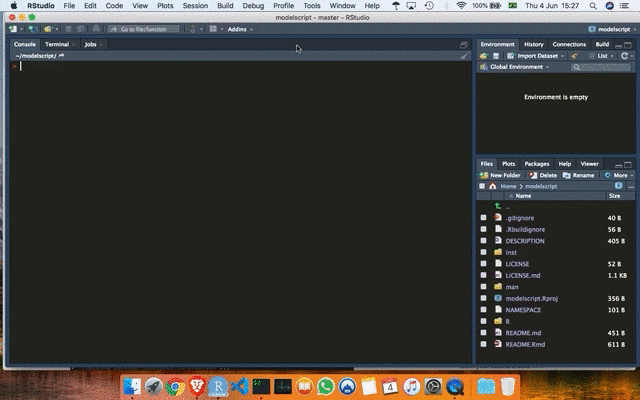

<!-- README.md is generated from README.Rmd. Please edit that file -->

```{r, include = FALSE}
knitr::opts_chunk$set(
  collapse = TRUE,
  comment = "#>",
  fig.path = "man/figures/README-",
  out.width = "100%"
)
```

# modelscript

<!-- badges: start -->
<!-- badges: end -->

modelscript is a little [RStudio](https://rstudio.com/) addin that creates a modelling template in a new .R file. I made it as a helper when learning how [tidymodels](https://www.tidymodels.org/) works, so it's geared towards that.

## Installation

You can install modelscript with [remotes](https://github.com/r-lib/remotes):

```{r eval = FALSE}
remotes::install_github("RobertMyles/modelscript")
```

## Usage



## Template

The template contains a prep and a model building section. 'prep' contains subsections for:

- libraries
- data
- EDA
- tidy
- visualize

'Build Model' contains subsections for:

- 1: Initial Split 
- 2: Preprocessing 
- 3: Model Specification 
- 4: Hyperparameter Tuning Specification
- 5: Bundle into Workflow 
- 6: Cross Validation 
- 7: Tune 
- 8: Explore Tuning Results 
- 9: Finalize Workflow 
- 10: Final Fit 
- 11: Evaluate 


